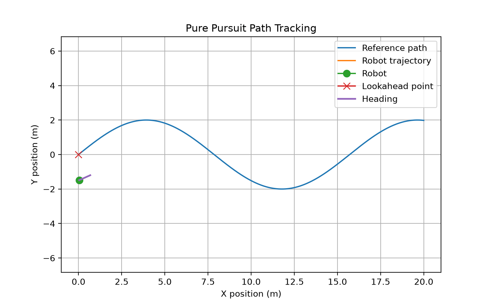

# ATLAS Controls Lab


A robotics controls and estimation sandbox built from first principles in Python.

This repository implements core ideas used in autonomous systems, including classical feedback control, optimal control, state estimation, attitude stabilization, and path tracking. The goal is to connect mathematical models with clean, reproducible simulations that can be extended toward robotics research, multi-agent systems, and real hardware platforms.

## Modules

### 1. PID Control: Mass-Spring-Damper System

A classical second-order dynamic system controlled using a PID controller.

This module simulates a mass-spring-damper system tracking a target position. It reports final error, overshoot, and control effort.

Generated figures:

- `figures/pid_mass_spring_damper_position.png`
- `figures/pid_mass_spring_damper_control.png`

Run:

```bash
python notebooks/01_pid_mass_spring_damper.py
```

### 2. LQR Control: Inverted Pendulum

A linearized inverted pendulum on a cart stabilized using a Linear Quadratic Regulator.

This module demonstrates optimal control through state-space modeling, Riccati equation solving, and feedback gain computation.

Generated figures:

- `figures/lqr_inverted_pendulum_angle.png`
- `figures/lqr_inverted_pendulum_cart_position.png`
- `figures/lqr_inverted_pendulum_control.png`

Run:

```bash
python notebooks/02_inverted_pendulum_lqr.py
```

### 3. Kalman Filter: 1D Tracking

A discrete-time Kalman filter used to estimate position and velocity from noisy position measurements.

This module demonstrates state estimation, prediction-update cycles, measurement noise handling, and RMSE comparison between raw measurements and filtered estimates.

Generated figures:

- `figures/kalman_1d_position_tracking.png`
- `figures/kalman_1d_velocity_estimation.png`

Run:

```bash
python notebooks/03_kalman_filter_1d_tracking.py
```

### 4. Drone Attitude PID Stabilization

A simplified 1D drone roll attitude model stabilized using PID control.

This module connects control theory to aerial robotics by simulating attitude correction from an initial roll disturbance.

Generated figures:

- `figures/drone_attitude_pid_angle.png`
- `figures/drone_attitude_pid_angular_velocity.png`
- `figures/drone_attitude_pid_control_torque.png`

Run:

```bash
python notebooks/04_drone_attitude_pid.py
```

### 5. Pure Pursuit Path Tracking

A unicycle robot model tracks a sinusoidal reference path using a pure pursuit controller.

This module demonstrates autonomous path following, lookahead-point selection, heading correction, steering commands, and tracking error analysis.

Generated figures:

- `figures/pure_pursuit_path_tracking.png`
- `figures/pure_pursuit_tracking_error.png`
- `figures/pure_pursuit_angular_velocity.png`

Run:

```bash
python notebooks/05_path_tracking_pure_pursuit.py
```

## Repository Structure

```text
atlas-controls-lab/
├── notebooks/
│   ├── 01_pid_mass_spring_damper.py
│   ├── 02_inverted_pendulum_lqr.py
│   ├── 03_kalman_filter_1d_tracking.py
│   ├── 04_drone_attitude_pid.py
│   └── 05_path_tracking_pure_pursuit.py
├── src/
│   ├── controllers/
│   │   ├── pid.py
│   │   ├── lqr.py
│   │   └── pure_pursuit.py
│   ├── dynamics/
│   │   ├── mass_spring_damper.py
│   │   ├── inverted_pendulum.py
│   │   ├── drone_attitude.py
│   │   └── unicycle.py
│   └── estimation/
│       └── kalman.py
├── figures/
├── docs/
├── tests/
├── requirements.txt
└── README.md
```

## Installation

Create and activate a virtual environment:

```bash
python3 -m venv .venv
source .venv/bin/activate
```

Install dependencies:

```bash
pip install -r requirements.txt
```

## Running Simulations

Each module can be run independently:

```bash
python notebooks/01_pid_mass_spring_damper.py
python notebooks/02_inverted_pendulum_lqr.py
python notebooks/03_kalman_filter_1d_tracking.py
python notebooks/04_drone_attitude_pid.py
python notebooks/05_path_tracking_pure_pursuit.py
```

Generated plots are saved in the `figures/` directory.

## Technical Focus

This repository focuses on:

- Classical feedback control
- PID control
- Optimal control
- Linear Quadratic Regulator design
- State-space modeling
- Sensor fusion and estimation
- Kalman filtering
- Drone attitude stabilization
- Mobile robot path tracking
- Robotics simulation
- Clean, reusable engineering software

## Roadmap

Planned future modules:

- Extended Kalman filter for nonlinear tracking
- Quadrotor altitude control
- Multi-robot formation control
- Model Predictive Control
- ROS 2 integration
- Hardware-in-the-loop control experiments
- Unit tests and GitHub Actions CI

## Status

Active development.
